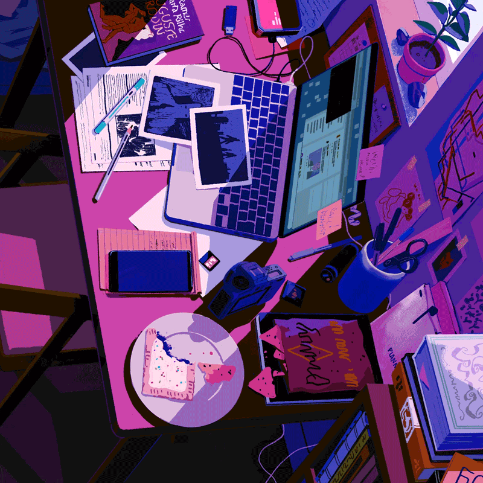

<table>
  <tr>
    <td width="62%" valign="middle">
      <h1>Hey there, I'm Ujjawal 👋</h1>
      <a href="https://github.com/Ujjawalmaurya">
        
      </a>
      <br /><br />
      <p>
        <b>Software developer</b> working with <b>Python</b>, <b>Go</b>, <b>Dart / Flutter</b>, and <b>local AI</b>.<br />
        <i>"I build apps, break systems, and learn from both."</i>
      </p>
      <p>
        <a href="https://linkedin.com/in/ujjawalmauryaum"></a>
        <a href="https://github.com/Ujjawalmaurya"></a>
        <a href="mailto:ujjawalmauryaum@gmail.com"></a>
        <a href="https://twitter.com/monsterthatlies"></a>
        <a href="https://stackoverflow.com/users/12053457/ujjawal-maurya"></a>
      </p>
    </td>
    <td width="38%" align="center" valign="middle">
      
    </td>
  </tr>
</table>

```text
╭─ ujjawal@archbox ~
╰─$ fastfetch --developer
  OS        :: Arch Linux x86_64
  Role      :: Software Developer (Systems, Mobile & Applied AI)
  Core      :: Python • Go • Dart • JavaScript • FastAPI • Flutter • Node.js
  AI / ML   :: LangGraph • Ollama • Local LLMs • Chroma • FAISS • YOLOv8
  Focus     :: Fast local inference, concurrency, clean state management
```

<br />

### 🏆 Key Milestone

> **1st Prize — HyperSpace Hackathon 2026** (Team HackSquad)  
> Built **AI Scout**: Automated agricultural anomaly detection using **YOLOv8** and **multispectral NDVI** over drone imagery.

<br />

<div align="center">

### 🛠️ The Toolbelt

  <a href="https://skillicons.dev">
    
  </a>

<br /><br />

| Area | Stack & Tools |
| :--- | :--- |
| **Languages** | **Python** &bull; **Dart** &bull; **Go** &bull; **JavaScript** &bull; **TypeScript** |
| **Backends & APIs** | **FastAPI** &bull; **Node.js** &bull; **Express** &bull; **REST APIs** |
| **Mobile & Frontend** | **Flutter** &bull; **React** |
| **Applied AI & ML** | **LangGraph** &bull; **LangChain** &bull; **Ollama** &bull; **RAG** &bull; **YOLOv8** &bull; **Gemini / OpenAI / Claude** |
| **Databases & Vectors** | **PostgreSQL** &bull; **Supabase** &bull; **MongoDB** &bull; **Chroma** &bull; **FAISS** &bull; **Qdrant** |
| **Systems & Ops** | **Linux** (Daily Driver) &bull; **Docker** &bull; **Git** &bull; **Postman** |

</div>

<br />

<div align="center">

### 📊 GitHub Telemetry

  <a href="https://github.com/Ujjawalmaurya">
    
  </a>
  <a href="https://github.com/Ujjawalmaurya">
    
  </a>

  <br /><br />

  <a href="https://github.com/Ujjawalmaurya">
    
  </a>

</div>

<br />

<table>
  <tr>
    <td width="35%" align="center" valign="middle">
      
    </td>
    <td width="65%" valign="top">
      <h3>🤝 Let's Build Together</h3>
      <p>
        Always up for pairing on <b>local AI</b>, <b>backend systems</b>, or <b>open-source tools</b>.
      </p>
      <ul>
        <li>💬 <b>Talk to me about:</b> <b>RAG pipelines</b>, <b>LangGraph</b>, <b>FastAPI</b>, <b>Go concurrency</b>, or <b>Flutter internals</b></li>
        <li>⚡ <b>Currently tinkering:</b> <b>On-device models</b>, <b>Ollama</b>, and <b>edge inference</b></li>
        <li>📬 <b>Ping:</b> Catch me on <a href="https://linkedin.com/in/ujjawalmauryaum"><b>LinkedIn</b></a> or ping via <a href="mailto:ujjawalmauryaum@gmail.com"><b>email</b></a></li>
      </ul>
    </td>
  </tr>
</table>

<br />

<div align="center">
  
</div>
